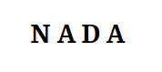
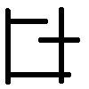
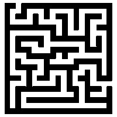
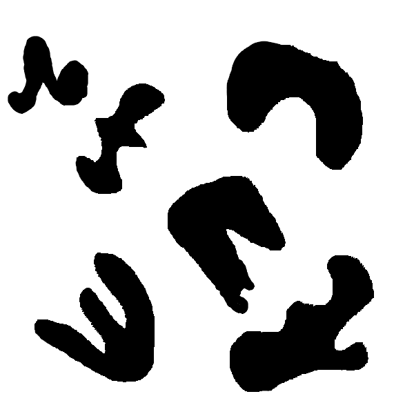

# A-star

These animations show the progression of teh A-star algorithm visually. The blue region denotes the explored space, while the red line in the end of the aimation is the path found.

  

  

 

 

 

